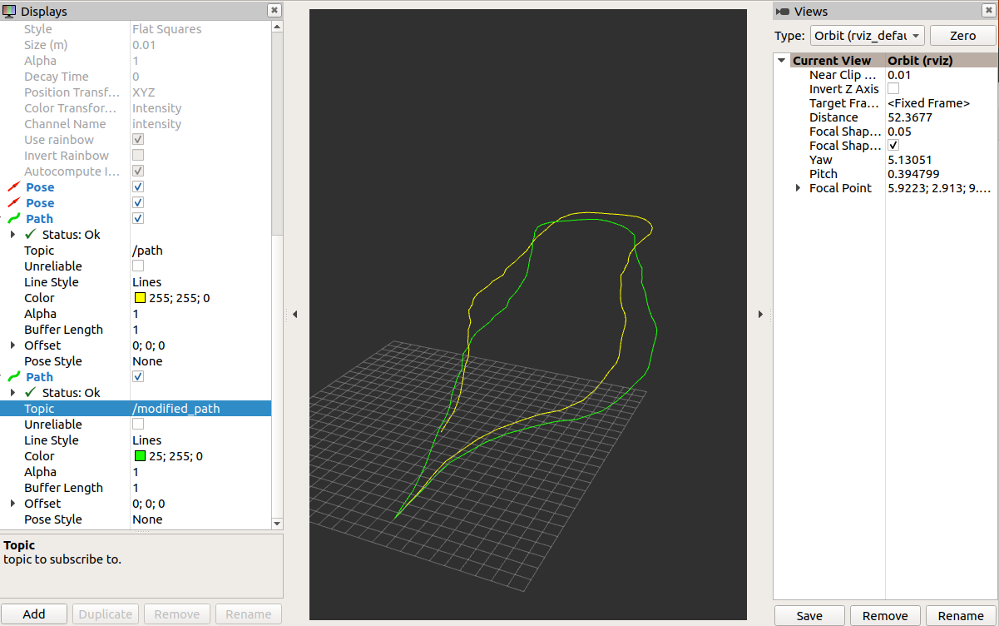
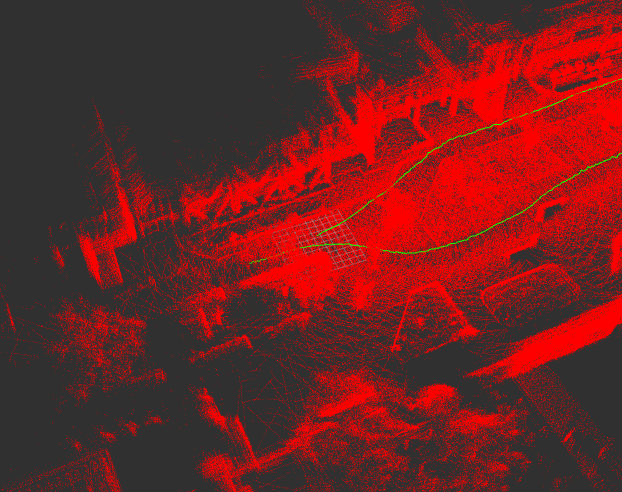

graphslam_ros2
====
  
this is ros2 slam package of the frontend using gicp/ndt scan matching and the backend using graph-based slam. 



Green: with loopclosure, Yellow: without loopclosure




## requirement to build
You need  [ndt_omp_ros2](https://github.com/rsasaki0109/ndt_omp_ros2) for scan-matcher and g2o for graph-based-slam.  

clone
```
git clone --recursive https://github.com/rsasaki0109/graphslam_ros2
```
g2o install
```
cd graphslam_ros2/Thirdparty/g2o/
mkdir build && cd build
cmake .. -DCMAKE_BUILD_TYPE=RELEASE 
make -j 4
make install
```
build
```
cd ~/ros2_ws
colcon build
```

## io

### frontend(scan-matcher) 
- input  
/initial_pose  (geometry_msgs/PoseStamed)  
/input_cloud  (sensor_msgs/PointCloud2)  
/tf(from "base_link" to LiDAR's frame)  
/imu  (sensor_msgs/Imu)(optional)  
/odom  (nav_msgs/Odometry)(optional)  

- output  
/current_pose (geometry_msgs/PoseStamped)  
/map  (sensor_msgs/PointCloud2)  
/path  (nav_msgs/Path)  
/tf(from "map" to "base_link")  
/map_array(graphslam_ros2_msgs/MapArray)

### backend(graph-based-slam)
- input  
/map_array(graphslam_ros2_msgs/MapArray)
- output  
/modified_map_array(graphslam_ros2_msgs/MapArray)  
/modified_path  (nav_msgs/Path)   
/modified_map  (sensor_msgs/PointCloud2)  

,and  `pose_graph.g2o` and `map.pcd` are saved in loop closing.

## params

- frontend(scan-matcher) 

|Name|Type|Default value|Description|
|---|---|---|---|
|registration_method|string|"NDT"|"NDT" or "GICP"|
|ndt_resolution|double|5.0|resolution size of voxels[m]|
|ndt_num_threads|int|0|threads using ndt(if `0` is set, maximum alloawble threads are used.)|
|trans_for_mapupdate|double|1.5|moving distance of map update[m]|
|vg_size_for_input|double|0.2|down sample size of input cloud[m]|
|vg_size_for_map|double|0.05|down sample size of map cloud[m]|
|use_imu|bool|false|whether imu is used or not for initial attitude in ndt(needed to be calcurated in advance by madgwick filter, kalman filter, and so on)|
|use_odom|bool|false|whether odom is used or not for initial attitude in ndt|


- backend(graph-based-slam)

|Name|Type|Default value|Description|
|---|---|---|---|
|ndt_resolution|double|5.0|resolution size of voxels[m]|
|voxel_leaf_size|double|0.2|down sample size of input cloud[m]|
|loop_detection_period|int|1000|period of serching loop detection[ms]|
|threshold_loop_clousure_score|double|1.0| fitness score of ndt for loop clousure|
|distance_loop_clousure|double|20.0| distance far from revisit candidates for loop clousure[m]|
|range_of_searching_loop_clousure|double|20.0| range of sezrching revisit candidates for loop clousure[m]|

## demo
### frontend and backend
demo data(ROS1) is `hdl_400.bag` in [hdl_graph_slam](https://github.com/koide3/hdl_graph_slam)

```
rviz2 -d src/graphslam_ros2/scanmatcher/config/mapping.rviz 
```

```
ros2 launch graphslam_main main.launch.py
```


```
ros2 topic pub initial_pose geometry_msgs/PoseStamped '{header: {frame_id: "map"}, pose: {position: {x: 0, y: 0}, orientation: {z: 0, w: 1}}}' --once
```


```
ros2 bag play -s rosbag_v2 hdl_400.bag 
```


Green: with loopclosure, Yellow: without loopclosure


### frontend only
- car_mapping

demo data(ROS1) by Autoware Foundation

```
wget http://db3.ertl.jp/autoware/sample_data/sample_moriyama_150324.tar.gz
tar zxfv sample_moriyama_150324.tar.gz
```

```
rviz2 -d src/graphslam_ros2/scanmatcher/config/mapping.rviz 
```

```
ros2 launch scanmatcher mapping_car.launch.py
```

```
ros2 topic pub initial_pose geometry_msgs/PoseStamped '{header: {frame_id: "map"}, pose: {position: {x: 0, y: 0}, orientation: {z: 0, w: 1}}}' --once
```

```
ros2 bag play -s rosbag_v2 sample_moriyama_150324.bag 
```


Yellow: without loopclosure

- mobilerobot_mapping
 
demo data(ROS1) is `hdl_400.bag` in [hdl_graph_slam](https://github.com/koide3/hdl_graph_slam)
```
rviz2 -d src/graphslam_ros2/scanmatcher/config/mapping.rviz 
```

```
ros2 launch scanmatcher mapping_robot.launch.py
```

```
ros2 topic pub initial_pose geometry_msgs/PoseStamped '{header: {frame_id: "map"}, pose: {position: {x: 0, y: 0}, orientation: {z: 0, w: 1}}}' --once
```

```
ros2 bag play -s rosbag_v2 hdl_400.bag 
```


Yellow: without loopclosure


## Used Libraries 

- Eigen
- PCL(BSD3)
- g2o(BSD2 except a part)
- [ndt_omp](https://github.com/koide3/ndt_omp) (BSD2)
