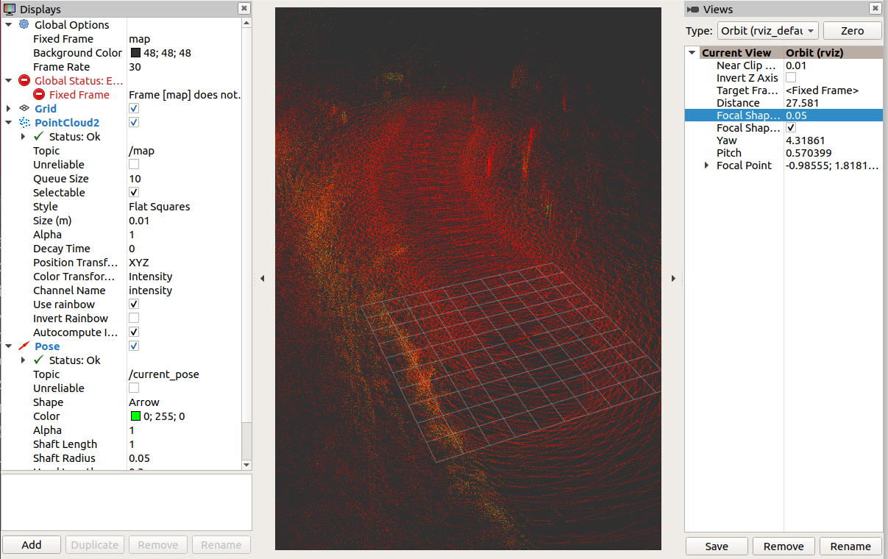
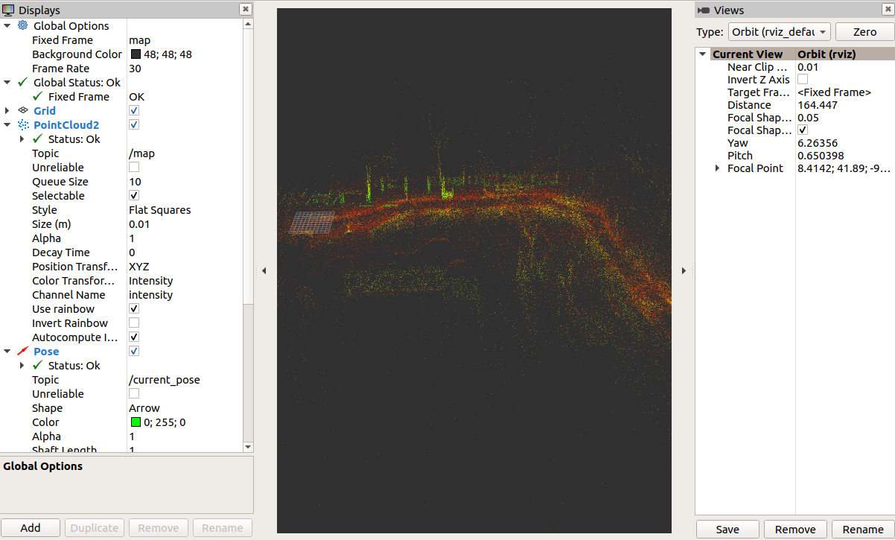

graphslam_ros2
====
this is a ros2 slam package of the frontend using gicp/ndt scan matching and the backend using graph-based slam. 
## requirement to build
You need install g2o, or
```
git clone --recursive https://github.com/rsasaki0109/graphslam_ros2
```
## io
- input  
/initial_pose  (geometry_msgs/PoseStamed)  
/input_cloud  (sensor_msgs/PointCloud2)  
/tf(from "base_link" to LiDAR's frame) 
- output  
/current_pose (geometry_msgs/PoseStamped)  
/map  (sensor_msgs/PointCloud2)  
/tf(from "map" to "base_link")  

## params

- frontend 

|Name|Type|Default value|Description|
|---|---|---|---|
|registration_method|string|"NDT"|"NDT" or "GICP"|
|ndt_resolution|double|5.0|resolution size of voxels[m]|
|voxel_leaf_size|double|0.2|down sample size of input cloud[m]|
|trans_for_mapupdate|double|1.5|moving distance of map update[m]|
|vg_size_for_viz|double|0.1|resolution size of voxels for visualization[m]|

- backend(Unimplemented yet) 

|Name|Type|Default value|Description|
|---|---|---|---|
|ndt_resolution|double|5.0|resolution size of voxels[m]|
|voxel_leaf_size|double|0.2|down sample size of input cloud[m]|
|loop_detection_period|int|1000|period of serching loop detection[ms]|
|threshold_loop_clousure|double|1.0| fitness score of ndt for loop clousure|
|distance_loop_clousure|double|4.5| distance from revisit candidates for loop clousure[m]|

## demo
### frontend only
- car_mapping

demo data(ROS1) by Autoware Foundation

```
wget http://db3.ertl.jp/autoware/sample_data/sample_moriyama_150324.tar.gz
tar zxfv sample_moriyama_150324.tar.gz
```

```
rviz2 -d src/graphslam_ros2/scanmatcher/config/mapping.rviz 
```

```
ros2 launch scanmatcher mapping_car.launch.py
```

```
ros2 topic pub initial_pose geometry_msgs/PoseStamped '{header: {frame_id: "map"}, pose: {position: {x: 0, y: 0}, orientation: {z: 0, w: 1}}}' --once
```

```
ros2 bag play -s rosbag_v2 sample_moriyama_150324.bag 
```



- mobilerobot_mapping
 
demo data(ROS1) is `hdl_400.bag` in [hdl_graph_slam](https://github.com/koide3/hdl_graph_slam)
```
rviz2 -d src/graphslam_ros2/scanmatcher/config/mapping.rviz 
```

```
ros2 launch scanmatcher mapping_robot.launch.py
```

```
ros2 topic pub initial_pose geometry_msgs/PoseStamped '{header: {frame_id: "map"}, pose: {position: {x: 0, y: 0}, orientation: {z: 0, w: 1}}}' --once
```

```
ros2 bag play -s rosbag_v2 hdl_400.bag 
```



### frontend and backend(Unimplemented yet)
demo data(ROS1) is `hdl_400.bag` in hdl_graph_slam


```
ros2 run graphslam_main graphslam_node(ros2 run graph_based_slam graph_based_slam_node) 
```


```
ros2 topic pub initial_pose geometry_msgs/PoseStamped '{header: {frame_id: "map"}, pose: {position: {x: 0, y: 0}, orientation: {z: 0, w: 1}}}' --once
```


```
ros2 bag play -s rosbag_v2 hdl_400.bag 
```

## Used Libraries 

- Eigen
- PCL(BSD3)
- g2o(BSD2 except a part)
