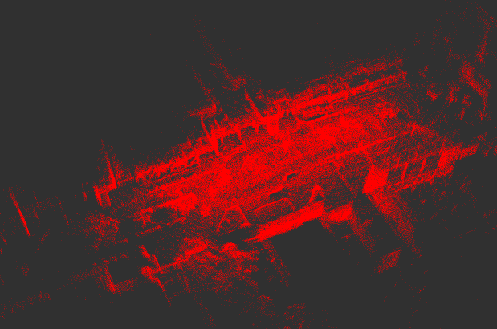
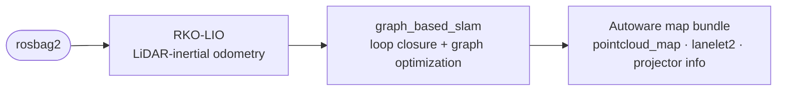

# lidarslam_ros2

[](https://github.com/rsasaki0109/lidar_slam_ros2/actions/workflows/main.yml)
[](https://opensource.org/licenses/BSD-2-Clause)
[](#support-and-license)
[](https://github.com/rsasaki0109/lidar_slam_ros2/stargazers)

**Turn a rosbag into a map you can actually drive on.**

ROS 2 LiDAR SLAM that outputs an Autoware-compatible map bundle — `pointcloud_map/`, `map_projector_info.yaml`, and auto-generated lanelet2. Frontend is `RKO-LIO` (MIT), backend is `graph_based_slam` (BSD-2). No GPL components on the default workflow.



*Shinjuku point cloud map built from a demo rosbag with this stack — start at the [Quickstart](#quickstart). `develop` is the default branch; current release candidate notes: [v0.9.1](docs/releases/v0.9.1.md). [日本語クイックスタート](docs/getting-started-ja.md).*

## Quickstart

### Choose your shortest path

| Goal | Start here | Safety and cost boundary |
| --- | --- | --- |
| See a verified map, no build | **Default if unsure:** [Docker demo](#try-it-with-docker-one-command-no-build) | Stable `v0.9.0-humble`; needs Docker; host writes stay in `./lidarslam_output`. |
| Map my own rosbag | [Own-bag route](#map-your-own-bag-one-command-after-install): `lidarslam-map doctor /path/to/rosbag2` | Read-only diagnosis first; then `lidarslam-map start /path/to/rosbag2` writes a new output. |
| Build the current candidate or contribute | [Source quickstart](#build--verified-demo-from-source-one-helper): `bash scripts/source_quickstart.sh --dry-run` | Candidate `v0.9.1`; needs ROS 2, 8 GiB, and roughly 30 minutes. |

### Try it with Docker (one command, no build)

```bash
docker run --rm -e LIDARSLAM_HOST_UID="$(id -u)" -e LIDARSLAM_HOST_GID="$(id -g)" \
  -v "$PWD/lidarslam_output:/lidarslam_ws/output" \
  ghcr.io/rsasaki0109/lidar_slam_ros2:v0.9.0-humble
```

Use the latest published stable image (`v0.9.0-humble`) for the 517 MB MID-360 demo; it writes `lidarslam_output/mid360_demo/` and returns ownership via UID/GID. The `v0.9.1` release candidate is not published yet; use the [source quickstart](#build--verified-demo-from-source-one-helper) for that candidate. See [Getting Started](docs/getting-started.md) for other platforms.

### Map your own bag (one command after install)

```bash
lidarslam-map start /path/to/rosbag2
```

Not sure where to begin? Run `lidarslam-map` with no arguments in a terminal; its safe home offers an installation check, the demo, your own bag, or previous sessions. Before finding a bag, run `lidarslam-map doctor`; it uses no network, writes no files, and prints one recovery action for each missing requirement.
`start` checks sensor setup before writing. See [supported inputs and recovery](#use-your-own-bag).

### Build + verified demo from source (one helper)

```bash
mkdir -p ~/ros2_ws/src
cd ~/ros2_ws/src
git clone --recursive https://github.com/rsasaki0109/lidar_slam_ros2.git
cd lidar_slam_ros2
bash scripts/source_quickstart.sh
```

The helper detects Humble/Jazzy, verifies the exact maintained six-package inventory, installs repository-only dependencies, builds only that list, and runs the verified demo. Use `--dry-run` or `--build-only`.
Completion prints an absolute `lidarslam-map` path that auto-activates this build in a fresh terminal—no remembered `source install/setup.bash`. ROS 2 must be installed. Allow 8 GiB and roughly 30 minutes; see [Getting Started](docs/getting-started.md) and [Operator workflows](docs/workflows.md) for contracts and contributor tests. Before handoff, run the read-only offline package audit: `python3 scripts/check_first_map_verification_package.py --json` and continue only on `READY`.

## Use your own bag

For an Ouster, Velodyne, RoboSense, simulated, or another compatible PointCloud2 bag, do not edit this package's launch files or YAML first; run `lidarslam-map doctor /path/to/rosbag2`, then `start` detects the inputs, builds a verified map, and opens it.
The guided path checks topics, frames, fields, timestamps, a maintained profile, and calibration; unsafe inputs stop with a stable reason code and one next action, while detection alone is not a verified vendor-support or accuracy claim. PointCloud2+Imu, PointCloud2+NavSatFix, and VelodyneScan+Applanix GSOF49 are the maintained input combinations.

```bash
lidarslam-map start /path/to/rosbag2
```

With Docker but no ROS installation, run the same high-level workflow from this checkout; the bag is mounted read-only and all output returns to your user:

```bash
bash scripts/docker_map_bag.sh /absolute/path/to/rosbag2
```

See [Docker Own-Bag Map](docs/getting-started.md#docker-own-bag-map) for dry-run, Jazzy, calibration, immutable-image, and private no-write JSON-plan options.

For RKO-LIO profiles, `--editable` retains deterministic replay input for later loop fixes. A successful run writes
Autoware artifacts; `lidarslam-map view "$PWD/output/my_map"` provides offline 3D review and
source-preserving edit plans that `lidarslam-map edit` applies without extra replay paths.
Reopen runs with `lidarslam-map sessions`, compare two with `lidarslam-map compare day1 day2`, create a private-by-default issue ZIP with `lidarslam-map support day1`, prepare a verified first-map report with `lidarslam-map support day1 --first-map`, or merge visits with `lidarslam-map merge day1 day2 --output-dir site_project`.
For fixed Docker/source output, use `lidarslam-map report /path/to/output/mid360_demo --json` when the reviewed candidate CLI is installed; the stable-image fallback and attachment boundary are in the [first-map validation guide](docs/external-first-map-validation.md).
Automation can use `lidarslam-map run`; direct launches and filtering are in [Operator workflows](docs/workflows.md).


## Why lidarslam_ros2

Most LiDAR SLAM stacks stop at a trajectory and a point cloud. This one ships the
artifacts you need downstream:

- **Autoware-compatible output** — `pointcloud_map/` + `map_projector_info.yaml` open
  directly in Autoware map loaders; `verify_autoware_map.py` prints
  `map_verify: PASS` on every saved bundle.
- **lanelet2 auto-generation** — drivable lanelets from the SLAM trajectory,
  validated for multi-segment Autoware routing.
- **Surveyed ground truth** — releases are gated in CI by per-dataset APE
  thresholds, including total-station checkpoints on a Livox MID-360
  ([accuracy](#accuracy)).
- **Loop closure, GPL-free** — opt-in built-in Scan Context, BEV / SOLiD /
  STD/BTC-style Triangle descriptors, and 3D-BBS verification.
- **Tunnel / fog degeneracy presets** — opt-in radar fusion and gravity
  alignment map a ~500 m self-similar tunnel end-to-end
  ([result](#tunnel-and-fog-mapping-without-degeneracy-collapse), [guide](docs/degeneracy-guide.md)).
- **Deterministic offline mapping** — backend and frontend offline runners produce
  byte-identical trajectories, loop edges, and submaps under the release gate.
- **Globally refined, quality-gated maps** — clean-room plane bundle adjustment
  refines submap poses under holdout-validated quality thresholds
  ([evidence](docs/research/map-quality-baseline.md)).
- **GNSS and camera output** — optional georeferencing plus calibration-aware,
  occlusion-resistant camera colouring.


```mermaid
flowchart LR
    bag(["rosbag2"]) --> rko["RKO-LIO<br/>LiDAR-inertial odometry"]
    rko --> gbs["graph_based_slam<br/>loop closure + graph optimization"]
    gbs --> bundle["Autoware map bundle<br/>pointcloud_map · lanelet2 · projector info"]
```

## Camera-coloured point-cloud maps

The pipeline registers LiDAR scans with the corrected trajectory, then projects
synchronized camera pixels onto that geometry. This RTK-SLAM Construction Hall
1 result follows the full estimated 60 m walking loop.

 ([MP4](lidarslam/images/map_flythrough_rtkslam.mp4) · [GIF](lidarslam/images/map_flythrough_rtkslam.gif))

K4 has 4.91 M points, 76.66% colour coverage, and 11/11 profile checks passing. Pose-aware dynamic cleaning before K3's camera fusion improves held-out RGB median from 41.17 to 40.54 and planar roughness median from 7.23 to 6.40. See the [release-readiness record](docs/research/colored-map-release-readiness-2026-07.md) for paired K3/K4 evidence and limits. The sequence is from RTK-SLAM (CC-BY 4.0); its total-station checkpoints also drive the [accuracy gate](#accuracy).

If graph optimization outputs sparse keyframes, the coloured-map pipeline can
propagate their corrections onto the dense SLAM pose stream automatically:

```bash
python3 tools/colored_map/colored_map_pipeline.py \
  <bag> output/<run>/traj_corrected.tum output/<run>/colored_map \
  --raw-traj output/<run>/traj_raw.tum \
  --extrinsic configs/gaussian_splatting/<lidar_camera_extrinsic>.yaml
```

The pipeline caches `dense_corrected_trajectory.tum` and rebuilds stale downstream artifacts; use `--force-trajectory` for an explicit refresh.
Moving rigs can add `--refine-spatiotemporal-calibration`; see the [held-out-gated design and RTK-SLAM result](docs/research/colored-map-spatiotemporal-calibration-2026-07.md).
Cross-repository gates (`public_suite_v1.yaml`, frozen OFF/ON promotion): [Benchmarking](docs/benchmarking.md#slam-candidate-regression).

## Open-source benchmark results

On the same HILTI 2022 `exp04` LiDAR/IMU input and CPU-only host, the competitive
profile recorded **34.7% lower median APE RMSE than GLIM** over three runs:

| System | Median APE RMSE | Median processing RTF | Maximum peak RSS |
| --- | ---: | ---: | ---: |
| **lidarslam_ros2** | **0.0565 m** | 0.993 | **586.83 MB** |
| GLIM CPU | 0.0866 m | **0.244** | 690.88 MB |

This is a scoped HILTI `exp04` trajectory-accuracy and peak-memory win; GLIM
wins runtime. It is not an overall best-system claim. Normal development needs only
one new run:

```bash
python3 scripts/run_ours_competitive_benchmark.py \
  --bag <hilti-exp04-ros2-bag> \
  --reference-tum <common-six-checkpoints.tum> \
  --reference-meta <common-six-checkpoints.json> \
  --rko-param configs/hilti2022/rko_lio_hilti2022_pandar_competitive_v2.yaml \
  --lidarslam-param configs/hilti2022/lidarslam_competitive_v2.yaml \
  --output output/hilti_exp04_ours_n1 --runs 1
```

The GLIM CPU counterpart is:

```bash
python3 scripts/run_glim_benchmark.py \
  --bag <hilti-exp04-ros2-bag> \
  --output output/hilti_exp04_glim_n1 --runs 1
```

Exact scoring rules, revisions, checkpoint policy, and map-quality limitations
are in [Comparison](docs/comparison.md#same-input-hilti-2022-exp04-vs-glim-cpu).

The separate Voxel-SLAM `v17` research candidate also achieved the lowest
geometric-mean APE across NavINST, Oxford, and UrbanNav: **2.2836 m**, versus
GLIM `5.0779`, Point-LIO `3.8388`, FAST-LIO2 `6.9576`, and fixed Voxel-SLAM
`2.7160` — **55.0% lower than GLIM**. It is not the default release path, does
not win every sequence, and is not fresh-blind evidence. Exact revisions,
per-sequence results, input hashes, resource results, map limitations, and
reproduction notes are in [Comparison](docs/comparison.md#voxel-slam-v17-research-candidate-vs-pinned-oss-rivals).

<!-- BEGIN GENERATED COMPETITIVE CLAIM PUBLICATION -->
<!-- END GENERATED COMPETITIVE CLAIM PUBLICATION -->

## Accuracy

Release-gate thresholds ([Benchmarking](docs/benchmarking.md#release-gate-accuracy-snapshot)) block every release in CI.

Tunnel and fog mapping: [Degeneracy Resilience Guide](docs/degeneracy-guide.md).

## Docs

- **Getting started**: [Getting Started](docs/getting-started.md) · [Distribution](docs/distribution.md) · [Autoware quickstart](docs/autoware-quickstart.md) · [Operator workflows](docs/workflows.md) · [Autoware Foxglove](docs/autoware-foxglove.md)
- **Pipelines**: [Autoware-compatible map authoring](docs/autoware-map-authoring.md)
- **Benchmarking**: [Benchmarking and release gate](docs/benchmarking.md) · [Comparison](docs/comparison.md)
- **Project**: [Product contract](docs/product-contract.md) · [v1.0 readiness](docs/v1-readiness.md) · [Independent first-map validation](docs/external-first-map-validation.md) · [v0.9.1 RC notes](docs/releases/v0.9.1.md) · [v0.9 roadmap](docs/roadmap/v0.9.md) · [Contributing](CONTRIBUTING.md) · [Support](SUPPORT.md) · [Security](SECURITY.md) · [Governance](GOVERNANCE.md) · [Changelog](CHANGELOG.md) · [Releasing](RELEASING.md)

Preview the doc site locally: `python3 -m mkdocs serve`.

## Support and license

| ROS 2 distro | Ubuntu | Scope |
| --- | --- | --- |
| Humble | 22.04 | default workflow build + package tests in CI |
| Jazzy  | 24.04 | default workflow build + package tests in CI; Autoware dogfood exercised locally |

`graph_based_slam` is BSD-2-Clause; `RKO-LIO`, `DLIO`, and the optional vendored
`3D-BBS` are MIT; `FAST_GICP` is BSD-3-Clause; built-in Scan Context is local. GPL-only
components (`Thirdparty/lio-sam`, `Thirdparty/3d_bbs`) are excluded via `COLCON_IGNORE`.

## Quality gates

```bash
bash scripts/run_default_ci_checks.sh
```
Full gate list and parameter pointers: [docs/workflows.md](docs/workflows.md).

If this project saves you mapping time, a ⭐ helps others find it.
