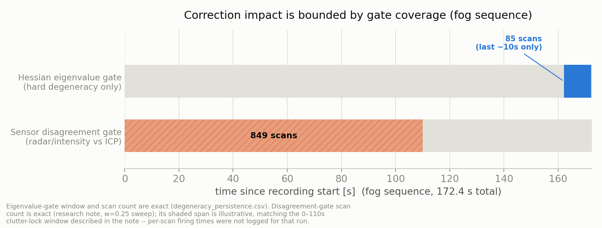
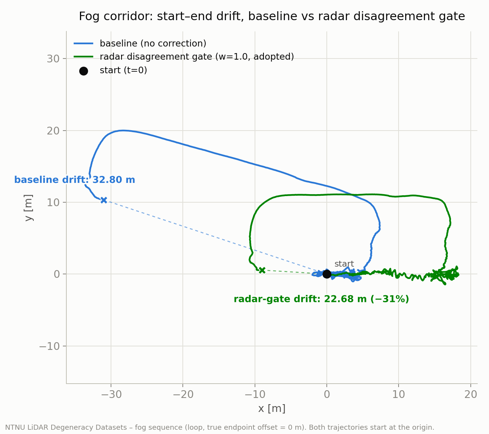
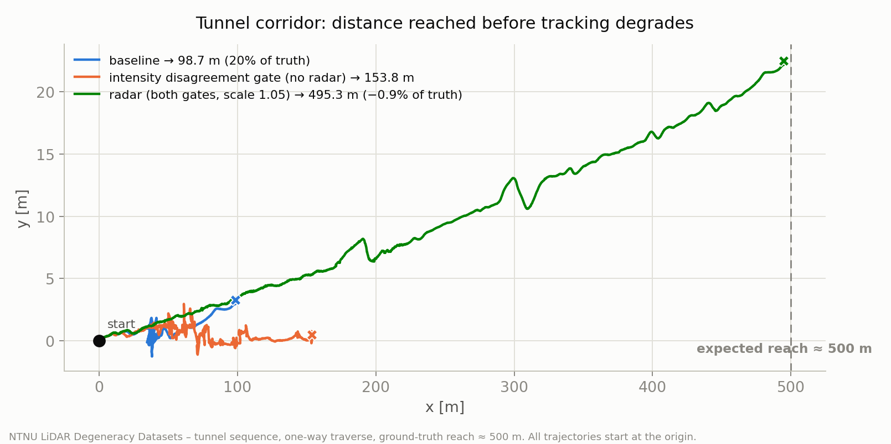

# LiDAR退化に「固有値ゲート」だけでは勝てない — radar/intensityの一貫性ゲートで詰める

濃霧の廊下とトンネルという、LiDAR SLAMが素直に壊れる2つの環境で、
[RKO-LIO](https://github.com/rsasaki0109/lidar_slam_ros2) の退化対策をA/Bした記録です。
教科書的な「Hessian固有値で弱い方向を検出してpriorを足す」アプローチは、どちらの環境でも
ほぼ効きませんでした。代わりに「radar/intensityの速度とICPの速度が食い違っているか」を
見るゲートに切り替えたところ、fogで始点–終点ずれが32.80 m→22.68 m (-31%)、tunnelで
到達距離が98.7 m→457.1 m、スケール較正込みで495.3 m(真値~500 mの99%)まで伸びました。
効かなかった実験も正直に記録しています。

データセットはNTNU LiDAR Degeneracy Datasets
([paper](https://ar5iv.org/abs/2403.05332) /
[repo](https://github.com/ntnu-arl/lidar_degeneracy_datasets))。GTが無いため指標は
fog(ループ収録、真値0 m)の始点–終点ずれと、tunnel(片道~500 m)の到達距離です。

## 課題設定

- **fog**: エアロゾルがセンサと一緒に動くため、ICPは「周りが動いている」ことを検出できず、
  健全なHessian(固有値的には退化していない)のまま誤った並進を出し続けます。リターン点数も
  3.7k〜8.8k点まで減ります。
- **tunnel**: 円筒対称に近い形状で進行方向の並進とロールが幾何的に拘束されない、教科書通りの
  退化です。baselineは片道500 mのうち98.7 mで実質ロストします。

方針は「弱い方向だけを外部センサで補う」という
[以前のスライド](https://speakerdeck.com/naokiakai/lidar-slamnoshi-zhuang-tosensarong-he-liequn-karacontinuous-time-liomade?slide=25)
の考え方です。全部をradarに任せず、LiDARが自信を持てない方向だけを埋めます。

## なぜHessian固有値ゲートでは捕まらないか — 「クラッタロック」

最初に試したのは、ICPのHessian固有値比で「弱い方向」を検出し、radar ego-velocity priorや
IMU priorを注入する王道パターンです。tunnelでは機能しますが、**fogではほぼ発火しません**。

fog区間(0–172.4秒、1723スキャン)を実測すると、固有値ゲートが確定したのはたった
**85スキャン**、しかも全てが録画末尾の**162.1–172.2秒(最後の約10秒)**に集中していました。
この区間は霧が晴れた廊下で、radarとLIOの速度が一致しており補正の余地がありません。閾値を
3e-4まで緩めても、霧の中(0–110秒)では一度も発火しませんでした。

理由はfogの退化が「情報不足」ではなく**「クラッタロック」**だからです。エアロゾル点群が
ある程度の構造を持って一緒に動くので、ICPは「ほぼ静止している」という誤った答えに高い
確信度(=健全なHessian)で収束します。固有値ゲートは「情報が足りているか」しか見ないため、
このactively wrongな収束を検出できません。証拠として、IMU加速度標準偏差(歩行振動、
~0.5 m/s²)は10秒以降ずっと存在する一方、radarのbody-x変位積分は96.9 mある一方でLIOは
64.2 mしか出ておらず、その差はendpoint誤差32.8 mとほぼ整合します。

Hessian固有値ゲートは最後の10秒(85/1723スキャン)にしか反応しない一方、後述の不一致ゲート
は霧が濃い区間全体に補正をかけます。**補正の効果はゲートのカバレッジで決まる** — これが
この検証を貫く教訓です。

## radar速度不一致ゲートの設計

固有値ではなくセンサ間の一貫性を見るゲートに切り替えました。

- radarのego-velocity(RANSAC最小二乗で`(x, y, z, intensity, velocity)`から推定)とICP
  並進速度を毎スキャン比較。
- 差が`radar_disagreement_min_mps`(0.2 m/s)を`radar_disagreement_min_scans`(10)スキャン
  連続で超えたら「不一致」と判定。
- 不一致中は**radarの観測方向のみに沿って**、並進を`radar_disagreement_weight`でradar変位側
  にブレンド(全方向ではなく、radarが実際に測れている軸だけ補正)。

重みスイープでは0.25→30.98 m、0.7→26.84 m、1.0(全置換)→**22.68 m**と単調に改善しました。
クラッタロック中のICPは「弱い」のではなく「能動的に誤っている」ため、中途半端に混ぜるより
完全に譲った方が良い結果になります。

## 結果

### fog: 32.80 m → 22.68 m

採用構成(w=1.0)で-31%。IMU弱方向prior(32.82 m)、radar Hessian弱方向prior(32.86 m)は
どちらも改善なし — 固有値ゲートがほぼ発火しない以上、priorを積んでも意味がないという
前節の議論通りの結果です。

### tunnel: 98.7 m → 457.1 m、スケール較正で495.3 m

tunnelでは固有値ゲートが正しく機能します(1981スキャンでradar prior融合)。そこに不一致
ゲート(1011スキャン補正)を重ねると両者が相補的に効き、到達距離は98.7 m→457.1 m
(真値の91%、横方向RMS 1.93 m)まで伸びました。

残る-8.6%はradar速度の系統的な過小評価(狭FOVのsingle-chip radarの観測限界、fogでの
速度比~0.62)で説明できます。`radar_velocity_scale`パラメータを追加してtunnelでスイープ
すると、**1.05倍で到達495.3 m(誤差-0.9%)**、1.10倍は519.8 m(+4.0%)で行き過ぎでした。
fogでは1.05倍にすると逆にわずかに悪化します(22.68 m→24.34 m、fogの補正方向のradar速度は
ほぼ不偏なため)。スケールはtunnel専用パラメータとして1.05を置き、共有デフォルトは1.0の
ままにしています(真値~500 mへのtuned値であることに注意)。

## radarが無い環境向け: intensity不一致ゲート

同じ「不一致ゲート」の考え方をintensityでも試しました。反射率1Dプロファイルのスキャン間
正規化相互相関から求めた速度とICP速度の不一致を見るゲートです(Hessian不要、軸は運動方向)。

- **tunnel(radarなし)**: 到達98.67 m→**153.75 m**(補正635スキャン)。radar併用の457 m
  には届きませんが、radar非搭載リグでも実質的な回復です。
- **fog**: 36.97 mと**baselineより悪化**。エアロゾルは相関自体は出ます(706/744スキャン)が、
  そこから求めた変位が誤った方向に誘導します。
- **HILTI 2022 exp07(mm精度GTのある長い屋内廊下)**: こちらも**全閾値で悪化**
  (APE 0.318 m→0.94〜2.39 m)。自己相似廊下では反射テクスチャ自体も走行軸に沿って
  周期的なため、相関が「もっともらしく誤った」シフトにエイリアスし、そのまま注入されて
  蓄積します。

つまりintensity不一致ゲートが有効なのは「**幾何は自己相似だが、反射テクスチャは特徴的**
(照明・標識・ケーブルなど)」という条件を満たす環境だけです(NTNU tunnelが該当)。
テクスチャまで自己相似な廊下(HILTI exp07)や、テクスチャが偽物のfogでは有害なので、
default-offの環境別オプトインが正しい運用です。

実装過程で実バグも1件発見・修正しました。相関が取れなかったスキャンでstreak(連続不一致
カウント)をリセットしていたのは「測定できなかった」と「一致していた」の混同でした。
リセットは「測定できてかつ一致した」場合か静止時のみに限定しています。

## 正直な限界: 効かなかった実験

Hessian固有値ベースの「弱方向prior注入」はintensityプロファイルでも実装しました(相関
0.85–0.98で変位を推定し既存prior枠に注入)。設計通り動作しますが、**tunnelのendpointは
変わりませんでした**。

原因はfogと同型です。固有値ゲートが確定するウィンドウは全行程のわずか~17%(末尾~55秒)
しかなく、距離欠損(2.3倍)の大部分は残り83%の「ゲートが確定しない軟らかい退化」で蓄積
します。ゲートが確定している区間ではIMU/幾何の初期推定が既に十分良く、測定シフトはノイズ
中心(平均-0.001 m、標準偏差0.027 m)でした。閾値を緩めても(相関0.5・25bin)結果は同じでした。

**教訓: 退化補正の効果は、値そのものの精度ではなくゲートのカバレッジで決まる。** Hessian
固有値は「硬い退化」しか拾えず、蓄積誤差の主因である「軟らかい退化・クラッタロック」は、
radar vs ICPのようなセンサ間一貫性シグナルでしか捕まえられません。
[BIEVR-LIO](https://github.com/ethz-asl/BIEVR-LIO)(RSS 2026)がvoxelごとのoriented height
imageへの直接レジストレーションを「常時オン」にしているのも、同じ教訓と整合します。
固有値ベースの検出をさらに突き詰める方向としては
[CUBE-LIO](https://www.docswell.com/s/scomup/KGNWXN-2026-07-06-154409)も参考になります。

fogでも「軟らかい退化」は未解決です。radar不一致ゲートで-31%まで詰めましたが、それでも
22.68 mのずれが残っています。

## 実装

Thirdparty配下のRKO-LIOに、**全てdefault-offで既存挙動をバイト同一に保ったまま**追加して
います。radar ego-velocity推定(RANSAC最小二乗、extrinsicは独立Wahba解と7.75°で一致)、
`radar_disagreement_gate`/`intensity_disagreement_gate`、intensityプロファイルの相関ベース
シフト推定、offline実行向けの時刻付きpriorキューが主な追加分です。テストは新規11件・既存
`test_degeneracy_aware_solve`(13件)含め全てgreenです。

## まとめ

- fog: radar速度不一致ゲート(w=1.0)で始点–終点ずれ32.80 m→22.68 m(-31%)
- tunnel: 両ゲート併用+スケール較正(1.05)で到達98.7 m→495.3 m(誤差-0.9%)
- radarなし環境: intensity不一致ゲートでtunnel 98.7 m→153.75 mまで部分回復
- 固有値ベースの弱方向prior注入はfog/tunnelどちらでもほぼ無効(ゲートのカバレッジが狭すぎる)
- 教訓: 退化補正の効果はゲートのカバレッジで決まる。センサ間一貫性ゲートは、固有値ゲートが
  見えない「軟らかい退化」まで届く

コードは[rsasaki0109/lidar_slam_ros2](https://github.com/rsasaki0109/lidar_slam_ros2)に
あります。フィードバック・追試の報告を歓迎します。

---

### 参考

- NTNU LiDAR Degeneracy Datasets: <https://github.com/ntnu-arl/lidar_degeneracy_datasets>
- 論文: <https://ar5iv.org/abs/2403.05332>
- BIEVR-LIO (RSS 2026): <https://github.com/ethz-asl/BIEVR-LIO>
- CUBE-LIO: <https://www.docswell.com/s/scomup/KGNWXN-2026-07-06-154409>
- 弱い方向だけを外部センサで補う設計思想: <https://speakerdeck.com/naokiakai/lidar-slamnoshi-zhuang-tosensarong-he-liequn-karacontinuous-time-liomade>
- 本記事のもとになった検証記録: `docs/research/lidar-degeneracy-radar-intensity-ab-2026-07.md`

## 追記 (2026-07-17)

本文の radar 不一致ゲート(fog 22.68 m)はその後、**連続情報重み付き融合**
(`radar_velocity_continuous_fusion`: 毎スキャン post-ICP で ICP 速度と radar 速度を
軸別信頼度でベイズブレンド)に発展し、fog の始点–終点ずれは **11.21 m** まで縮みました
(新アーキテクチャの baseline 35.57 m 比 3.2 倍改善)。それでも密結合手法(DR-LRIO、<1 m)には
届かず、逐次補正という構造の限界——ゲートのカバレッジの次は「結合の深さ」が効く——という
のが現時点の結論です。詳細はリポジトリの `docs/degeneracy-guide.md` と研究ノートを
参照してください。
