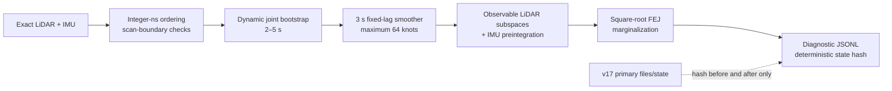

# v44 fixed-lag LiDAR/IMU shadow architecture

Date: 2026-08-10

Contract: `v44b-fixed-lag-shadow-architecture-20260810`

Status: architecture definition only

## Authority and boundary

Stage 1 established that all three exact raw LiDAR/IMU streams have usable
scan-relative point time, finite IMU measurements, bounded gaps, and at least
99.97% complete scan bracketing. Its sealed decision authorizes an architecture
definition, not an estimator implementation. This document defines that one
architecture.

The machine-readable source of truth is
`configs/sota_v6/development/v44b_fixed_lag_shadow_architecture.json`. It is
bound to the exact v44a readiness contract, source manifest, and aggregate by
SHA-256. The architecture cannot consume dataset identity, ground truth,
accuracy metrics, reference maps, camera, GNSS, wheel odometry, external pose,
message orientation, or v17 state. Per-source calibrated extrinsics remain
allowed because they are sealed sensor bindings rather than algorithm branches.

This stage permits only the next synthetic-contract implementation. It does
not permit raw replay, trajectory or map publication, estimator-state
writeback, accuracy scoring, or reference-map access.

## Data flow and isolation



The shadow path is one-way. It reads the same sealed sensors independently and
may write only its diagnostic evidence directory. It has no ROS publisher and
no pointer, callback, path, or output topic through which it can mutate v17.

## Frames and time

Transforms use `T_destination_source`. The state pose is `T_WB`, mapping the
body frame `base_link` into `map`. `T_BL` maps LiDAR points into the body and is
read from the exact sensor binding; `T_BI` is the bound IMU-to-body identity.
Neither extrinsic nor time offset is estimated online.

The world is right-handed with +z up. During bootstrap, gravity direction is a
two-degree-of-freedom `S2` variable with fixed magnitude `9.80665 m/s²`. At
bootstrap completion the world is rebased deterministically so
`g_W = [0, 0, -9.80665]`, the first position is the origin, and first-pose yaw
is zero.

All estimator time is signed integer nanoseconds:

- A point time is `header.stamp + uint32 t`.
- A knot time is the scan end, `header.stamp + max(t)`.
- A scan update waits for the first IMU message strictly after its end.
- Boundary IMU values are linearly interpolated; integration uses SO(3)
  midpoint updates.
- Wall clock never participates in ordering, age, integration, or stopping.
- Each source message is consumed once in stable timestamp/source-index order.

The v44a limits are inherited unchanged: 50 ms maximum IMU gap, 20 ms maximum
boundary bracket distance, and at least five IMU samples per scan. Up to two
unbracketed prefix scans may be dropped before the first state, matching the
sealed raw-stream contract. Once state creation starts, any interior boundary
hole is terminal. Up to two unbracketed end-of-stream suffix scans may be
dropped and must be reported.

## State and initialization

Every accepted LiDAR scan end creates one 15-DoF knot:

| Variable | Manifold | Local DoF | Meaning |
| --- | --- | ---: | --- |
| `R_WB` | SO(3) | 3 | body orientation in world |
| `p_WB` | R³ | 3 | body position in metres |
| `v_WB` | R³ | 3 | world velocity in m/s |
| `b_g` | R³ | 3 | gyroscope bias in rad/s |
| `b_a` | R³ | 3 | accelerometer bias in m/s² |

Initialization always uses the same dynamic joint bootstrap, even when the
startup happens to be stationary. It buffers 2–5 seconds, requiring at least
10 accepted LiDAR scans and 100 IMU messages. A robust mean acceleration gives
only a gravity seed. Zero velocity, zero angular rate, message orientation, and
stationary detection are not factors. Initial velocity comes from the first
available LiDAR translation divided by sensor time, or uses zero strictly as a
numerical seed with a broad prior. All bootstrap knots, gravity direction, and
both biases are optimized jointly.

This avoids the NavINST/Oxford orientation-availability mismatch and Oxford's
dynamic first two seconds without introducing a dataset branch.

## Explicit noise model

Message covariance is inventoried but ignored by every source so that missing
NavINST/Oxford covariance cannot change the algorithm. The single continuous-
time model is:

| Quantity | Global value |
| --- | ---: |
| Gyroscope white-noise density | `0.01 rad/s/√Hz` |
| Accelerometer white-noise density | `1.0 m/s²/√Hz` |
| Gyroscope-bias random walk | `0.0001 rad/s²/√Hz` |
| Accelerometer-bias random walk | `0.0001 m/s³/√Hz` |
| LiDAR point-to-plane sigma | `0.05 m` |
| LiDAR Huber delta | `1.345 sigma` |

Bootstrap priors are deliberately broad: `5 m/s` velocity, `0.05 rad/s`
gyro bias, `1 m/s²` accelerometer bias, and `30°` gravity direction. They are
not per-sequence tuning knobs.

## IMU factors

Adjacent knots are joined by bias-linearized midpoint preintegration. Stored
terms are `DeltaR`, `DeltaV`, `DeltaP`, a 9x9 covariance, and all five required
bias Jacobians:

`J_R_bg`, `J_v_bg`, `J_v_ba`, `J_p_bg`, and `J_p_ba`.

With biases linearized at knot `i`, residual directions are fixed as:

```text
r_R = Log((DeltaR * Exp(J_R_bg delta_bg))^-1 R_i^T R_j)
r_v = R_i^T (v_j - v_i - g dt)
      - (DeltaV + J_v_bg delta_bg + J_v_ba delta_ba)
r_p = R_i^T (p_j - p_i - v_i dt - 0.5 g dt^2)
      - (DeltaP + J_p_bg delta_bg + J_p_ba delta_ba)
r_bg = b_g_j - b_g_i
r_ba = b_a_j - b_a_i
```

Bias changes above `0.01 rad/s` or `0.1 m/s²` force deterministic
reintegration. Covariance is propagated in float64, symmetrized, and checked
for positive semidefiniteness. A timing-gap violation produces no state.

Unlike v33–v37, there is no direct velocity correction, accelerometer-bias
overwrite, weak-axis latch, or history-threshold update. Bias can move only
through the joint factor system above.

## LiDAR factor and observability

Each scan is deskewed into its scan-end body frame using IMU interpolation and
the fixed `T_BL`. Geometry is range-filtered to 1–50 m and deterministically
0.5 m voxelized to at most 12,000 points. A current scan may use the eight most
recent older active knots, with at most 200,000 active surfels. Surfel means
and normals stay in their source knot's scan-end body frame.

The point-to-plane residual connects both source and current poses:

```text
r_l = n_Bs^T R_WBs^T [
        (R_WBk p_Bk + p_WBk) - (R_WBs mu_Bs + p_WBs)
      ]
```

No global map, persistent map, loop search, or intensity identity term exists.
When a source knot is marginalized, its surfels cannot be used by future
factors.

For every LiDAR factor batch, the whitened Jacobian is expressed in the six-
DoF current-from-source relative-pose coordinates, with one metre per radian
rotation scaling. Deterministic SVD retains only modes satisfying:

```text
sigma >= max(1.0, sigma_max / 1,000,000)
```

Rejected modes add no measurement information. They are not frozen and are not
replaced by a guessed speed; their uncertainty continues through the IMU and
bias process. The full-lag bias-information Schur complement is diagnostic
only.

This does not claim that LiDAR/IMU can invent UrbanNav tunnel-axis speed. It
ensures that the estimator cannot falsely convert a weak LiDAR direction into
a confident state correction, which was the destructive failure mode of the
earlier direct-correction screens.

## Fixed-lag optimization and marginalization

The active horizon is 3 seconds and at most 64 knots. At the v44a maximum
allowed LiDAR rate of 20 Hz, 62 slots cover the horizon and two slots remain as
capacity margin. The maximum local dimension is 960.

Each accepted scan runs at most four deterministic Gauss–Newton iterations.
Factors and variables have fixed chronological/type order, the solver is
single-threaded, and linearization uses streaming Householder QR followed by
rank-revealing SVD of `R`. Fixed line-search scales are `1, 0.5, 0.25, 0.125`;
the first finite non-increasing cost is accepted. No wall-time or convergence-
history heuristic may change the work schedule.

The oldest state is marginalized when either the 3-second horizon or 64-knot
capacity is exceeded. Marginalization uses square-root QR and first-estimate
Jacobians (FEJ). The separator prior preserves the bootstrap origin/yaw gauge
and uses the same rank policy as the optimizer. Prior reset and ad-hoc
covariance inflation are forbidden.

## Resource and failure contract

| Bound | Limit |
| --- | ---: |
| Active knots / local dimension | `64 / 960` |
| Active LiDAR correspondences | `768,000` |
| Active surfels | `200,000` |
| Materialized Jacobian rows | `4,096` |
| Streaming QR block | `2,048 rows` |
| Dense solver storage | `16 MiB` |
| Input message | `8 MiB` |
| Diagnostic output | `256 MiB` |
| Peak RSS | `330 MiB` |
| Processing RTF | `0.85` |

Capacity is checked before allocation or output. Nonfinite state/cost/system,
invalid covariance, interior timestamp gaps, no acceptable optimizer step,
resource exhaustion, or protected-output identity change creates a terminal
failure record and no valid shadow result.

Diagnostics contain one record for every accepted or rejected LiDAR scan,
including state, bias, gravity, timing, correspondence count, observable rank,
singular values, nullspace dimension, marginal-prior rank, cost, iterations,
and RSS. The deterministic payload uses fixed little-endian integer/float64
ordering and SHA-256. Two repetitions must have identical state payloads.

## Why this is different from the rejected screens

| Rejected mechanism | v44b architectural guardrail |
| --- | --- |
| v22 raw `HTH(5,5)` z gate | whitened relative-pose SVD; no coordinate-specific proxy |
| v33 direct velocity correction | velocity changes only in the joint solve |
| v34/v35 direct `b_a` overwrite | explicit bias state and preintegration Jacobians only |
| v36/v37 speed/history threshold latch | no velocity threshold, latch, or quarantine scalar |
| v38 wall-clock/repeated scalar feedback | integer sensor time and exactly-once consumption |
| v38 producer-frozen weak axis | observability is recomputed in the current factor frame |
| v39 inaccurate visual speed | camera and visual velocity are forbidden inputs |
| v40–v43 global correction routes | active-window local factors only; no loop/global map |

## Stage-3 handoff

The contract enumerates 20 required synthetic contracts. They cover SO(3)
direction and gravity sign, zero-residual motion, finite-difference bias and
LiDAR Jacobians, covariance propagation, scan boundaries and deskew,
observability projection, dynamic and stationary startup through the same
path, square-root/FEJ marginalization, fixed-lag eviction, deterministic state
hashing, and fail-closed ordering/resource/protected-output behavior.

Only when every synthetic contract passes may a shadow estimator implementation
be considered for authorization. Even then, raw replay and all accuracy/map
inputs require later explicit gates.
