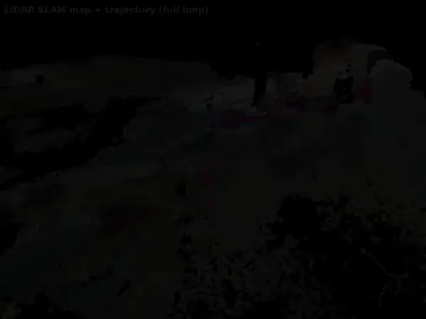

# tools/gaussian_splatting — LiDAR-primed 3DGS map deliverable (opt-in)

SLAM の出力（最適化軌跡 + pointcloud_map）から **3D Gaussian Splatting** の
photorealistic map / novel-view 成果物を後処理で再構成するための opt-in ツール群。

> **Note**: カメラ着色・マップエクスポート系のツール（gsplat 非依存:
> `pointcloud_io` / `build_lidar_init` / `colored_map_pipeline` /
> `render_map_flythrough` / 各種 export / BIM）は
> [`tools/colored_map/`](../colored_map/) へ移動した。旧パスは互換 shim で
> そのまま import / 実行できる。

設計の全体像・スコープ・ライセンス判断・PoC 計画は
[`docs/research/3dgs-postprocess-map-design.md`](../../docs/research/3dgs-postprocess-map-design.md)
を参照。

## 立ち位置（重要）

- これは **後処理ツール**であって SLAM 本体ではない。RKO-LIO / graph_based_slam
  は触らない。
- 3DGS は pointcloud_map を **置き換えない**。Autoware の localization は従来どおり
  PCD/NDT。3DGS は人間向け検査 / digital-twin / NVS の追加成果物。
- **opt-in**。`colcon` パッケージではない。CUDA を C++ ビルド/標準 CI に持ち込まない。

## ライセンス方針

- 本家 INRIA `gaussian-splatting` は **non-commercial** ライセンスのため**不採用**。
- rasterizer / 学習コアは **gsplat (Apache-2.0)** を前提とする。
- 本リポジトリの BSD-2/MIT 商用フリー方針を維持する。詳細は設計 doc §2。

## 構成

| ファイル | 役割 | 依存 | テスト |
|---|---|---|---|
| `posed_images.py` | GPU/ROS 非依存コア。TUM 軌跡パース、SLERP ポーズ補間、外部標定合成、Nerfstudio `transforms.json` 出力。 | numpy のみ | `test_gaussian_splatting_posed_images.py`（19）|
| `extract_posed_images.py` | rosbag2 から画像 + `camera_info` を取り出し、各画像の `world<-camera` を解決して `transforms.json` + 画像を書き出す CLI。`sensor_msgs/Image` は **numpy で生復号**（cv_bridge 非依存）、`rosbag2_py` は遅延 import。 | rosbag2_py（実行時のみ）| `test_gaussian_splatting_extract.py`（17、ポーズ/外部標定/復号ロジックは ROS 非依存）|
| `pointcloud_io.py` | 最小 PLY 入出力（xyz[+rgb]）＋ voxel 間引き＋ **画像投影による点群着色**（`colorize_by_projection`）。 | numpy のみ | `test_gaussian_splatting_pointcloud.py`（12）|
| `build_lidar_init.py` | bag のスキャンを SLAM 軌跡で world 系に蓄積 → **LiDAR-primed init 点群** PLY。per-point timestampがあれば1ms pose binで自動deskew（`--no-deskew` で比較可能）。FILE-compressed(zstd) bag 対応。`--color-transforms` でposed画像を投影して着色。 | rosbag2_py（実行時のみ）| 同上（`transform_points` / `deskew_points` 等の純粋部）|
| `colored_map_pipeline.py` | bag + TUM軌跡 + camera extrinsic から、posed画像抽出 → 遮蔽対応の複数view着色map生成を一括実行。既存成果物の再利用、`--dry-run`、段階別forceに対応。 | 上記2ツールと同じ | `test_colored_map_pipeline.py` |
| `../../scripts/evaluate_lidar_camera_alignment.py` | LiDAR depth境界とcamera画像edgeの距離を測り、外部校正をpixel単位で評価。 | numpy, imageio | `test_lidar_camera_alignment.py` |
| `../../scripts/evaluate_heldout_point_colors.py` | 偶数viewだけで点群を着色し、除外した奇数viewへのRGB再投影誤差を評価。 | numpy, imageio | `test_heldout_point_colors.py` |
| `plane_patch_warp.py` | LiDAR局所平面とcamera相対poseからplane-induced homographyを作り、direct alignment用patchをwarp/NCC評価。 | numpy | `test_plane_patch_warp.py` |
| `colorize_planar_references.py` | 平面ボクセルごとに参照patchを選び、遮蔽判定付きで一貫した色をPLYへ適用。 | numpy, imageio | `--help` |
| `../../scripts/check_colored_map_quality.py` | 軌跡APE、点群形状、外部校正、held-out着色の4レポートをprofile閾値で一括判定。 | PyYAML | `test_colored_map_quality_gate.py` |
| `train_gsplat.py` | `transforms.json` + 画像で gsplat 学習 → INRIA 標準 `.ply` 出力。OpenGL c2w を OpenCV w2c に変換。`--init-ply` で **LiDAR-primed init**（位置＋色 seed）、`--densify` で gsplat `DefaultStrategy` の adaptive density control、`--ssim-lambda`（既定 0.2）で INRIA 標準 **L1+D-SSIM 損失**、`--knn-scale-init` で点群の局所密度から per-Gaussian スケール seed、`--sh-degree D` で **視点依存カラー（SH 次数 D、INRIA 標準 f_dc+f_rest 出力）**、`--antialiased` で gsplat の antialiased rasterize mode、`--mcmc`（+`--mcmc-cap`）で MCMCStrategy（LiDAR-primed init では DefaultStrategy 優位＝既定）、`--optimize-extrinsic` で共有 6-DoF extrinsic の photometric 自己校正。学習終了時に全ビューの PSNR/SSIM を出力。 | torch, gsplat (CUDA) | `test_gaussian_splatting_train.py`（20、純粋部）|
| `selftest_gpu.py` | opt-in GPU セルフテスト。合成シーンを描画→`transforms.json`→学習→`.ply` の全鎖を検証。 | torch, gsplat (CUDA) | 手動実行（CI 非対象）|
| `render_path.py` | 学習済み `.ply` + `transforms.json` から**フライスルー動画（mp4/GIF）**を描画する CLI。INRIA `.ply` の読み戻し、学習視点を通る SLERP+box-smooth カメラパス、`--ping-pong` ループ、`--scale` 縮小描画、`--rotate` 横倒しカメラ補正。 | torch, gsplat (CUDA)（純粋部は numpy のみ）| `test_gaussian_splatting_render.py`（13、ply 読み戻し/パス/回転/intrinsics の純粋部）|

GPU 不要の純粋部は ament pytest harness（`run_default_ci_checks.sh`）で **計 89 ケース**
検証される。CUDA を要する学習部はテストを skip せず CI 面から分離（opt-in）。

## 使い方

```bash
# 1) bag から posed 画像 + transforms.json を抽出（ROS 環境）
#    --time-offset auto: カメラと LiDAR がセンサ内蔵クロックの別基準でも
#    bag全区間の受信時刻からoffset+driftをロバスト推定（Livox+camで頻出）
python3 tools/gaussian_splatting/extract_posed_images.py \
  --bag demo_data/koide_lidar_camera_calib/livox/rosbag2_2023_03_09-13_42_46 \
  --traj output/<run>/traj_corrected.tum \
  --camera-topic /image --camera-info-topic /camera_info \
  --extrinsic configs/gaussian_splatting/<lidar_camera_extrinsic>.yaml \
  --time-offset auto --clock-reference-topic /livox/points \
  --out output/<run>/gsplat

# autoは最大256組を一次回帰し、timestamp外れ値をMADで除外する。
# HILTI exp04はoffset -0.12us、drift -0.000074ppmで同期済みだった。
# auto後に実測した物理的な撮像残差だけを足す場合は
# --time-offset-adjustment <seconds> を使う（既定0、dataset間で検証すること）。

# 2a) LiDAR-primed init 点群を構築（COLMAP 不要の幾何事前）
python3 tools/gaussian_splatting/build_lidar_init.py \
  --bag <bag> --traj output/<run>/traj_corrected.tum \
  --points-topic /livox/points --voxel 0.05 \
  --out output/<run>/gsplat/lidar_init.ply

# 着色点群だけが目的なら、画像抽出 + robust複数view着色を一括実行
python3 tools/gaussian_splatting/colored_map_pipeline.py \
  <bag> output/<run>/traj_corrected.tum output/<run>/colored_map \
  --extrinsic configs/gaussian_splatting/<lidar_camera_extrinsic>.yaml \
  --points-topic /livox/points --camera-topic /image \
  --camera-info-topic /camera_info

# mono cameraをgeometry-only用途で意図的に使う場合だけ追加
# --allow-monochrome

# GT付き検証では外部reportを渡し、校正・held-out色・統合gateも一括実行
python3 tools/gaussian_splatting/colored_map_pipeline.py \
  <bag> output/<run>/traj_corrected.tum output/<run>/colored_map \
  --extrinsic configs/gaussian_splatting/<lidar_camera_extrinsic>.yaml \
  --trajectory-report output/<run>/metrics.json \
  --geometry-report output/<run>/map_quality_report.yaml \
  --quality-profile configs/colored_map_quality_profiles/<profile>.yaml

# Kalibr camchain + 別LiDAR calibration（HILTI形式）はextrinsicを自動合成。
# 疎な補正軌跡は --raw-traj の高密度軌跡へ自動伝播してから着色する
python3 tools/gaussian_splatting/colored_map_pipeline.py \
  <bag> output/<run>/traj_corrected.tum output/<run>/colored_map \
  --raw-traj output/<run>/traj_raw.tum \
  --kalibr-camchain calibration/camchain-imucam.yaml \
  --lidar-calibration calibration/lidar_calibration.yaml \
  --intrinsics-yaml calibration/camchain-imucam.yaml \
  --points-topic /hesai/pandar \
  --camera-topic /alphasense/cam0/image_raw

この形式ではcamera pose用の `body <- camera` と、点群積算用の
`body <- LiDAR` をそれぞれ校正ファイルから適用する。`traj` にはscanを補間できる
dense SLAM軌跡を渡すこと。疎なpose-graph keyframe列を使う場合は `--raw-traj` に
補正前のdense軌跡を渡すと、補正を全poseへ伝播した軌跡が出力先に保存・再利用される。
入力軌跡やposed画像が成果物より新しい場合は、依存する後段だけ自動再生成される。
pipelineはmono8やRGB 3chが同値の入力を既定で拒否し、輝度を3chへ複製した点群を
「カラー」と誤認しない。HILTI 2022のcam0〜cam4はすべてmono8なので幾何・軌跡
benchmark用とし、RGB着色はAIST Ouster公開bag（`/image`, bgr8, 2448×2048）で
検証する。geometry-only用途だけ `--allow-monochrome` で明示的に許可できる。

AIST Ouster RGB benchmarkは公式 `calib.json` を固定し、2 captureを分離して使う。

```bash
python3 tools/gaussian_splatting/colorize_from_bag.py \
  <aist-ouster-bag> output/aist_rgb \
  --pc-topic /points --image-topic /image \
  --camera-info-topic /camera_info --extrinsic-file <calib.json> \
  --time-frac 0.6 --max-pair-dt-ms 100 --report output/aist_rgb.json
```

16:25 captureはcoverage 9.5%、pair差33.4 ms、有彩色率57.7%、16:26の独立captureは
10.6%、22.5 ms、59.6%だった。coverageは単眼画角と360° Ouster scan全点の比である。
reportの `mean_channel_range` と `chromatic_fraction_10` でmono複製への退行も検出する。

単一scanの確認後は、全scan・全RGB viewからCPU-onlyの実着色mapを作る:

```bash
bash scripts/run_aist_ouster_rgb_map_benchmark.sh \
  --bag <aist-ouster-bag> --extrinsic <calib.json> \
  --output-dir output/aist_ouster_rgb_map
```

2 captureでmap全体の着色率34.7〜36.4%、有彩色率59.5〜64.1%、奇数view
heldout RGB L2 median 16.9〜21.0を確認した。scanmatcherは連続時間body poseではなく
scan単位registrationなので、検証済みrunnerはrigid-scan積算を明示し、RGBだけ良く見えて
地図厚みを悪化させる誤deskewを防ぐ。詳細と全gate値は
[`docs/research/aist-ouster-rgb-map-2026-07.md`](../../docs/research/aist-ouster-rgb-map-2026-07.md)。

`--quality-profile`は明示的opt-inで、`lidar_camera_alignment.json`、
`heldout_point_colors.json`、`colored_map_quality_gate.json`も出力する。
これらも入力より新しければ再利用し、`--force-quality`で品質3段階だけ再実行できる。
robust着色は1ピクセル単位のz-bufferで遮蔽を判定し、隣接ピクセルの前景によって
本来見える点が未着色になる粗いbin由来の欠落を防ぐ。
複数viewの統合にはRGB medoidを使い、チャネル別medianが実際には観測されていない
濁った合成色を作る問題も防ぐ。
画素サンプリングはedge-aware補間を使い、平坦部ではbilinearの滑らかさを保ちながら
強い色境界では実画素へ切り替え、前景色と背景色のにじみを抑える。
画像間の露出正規化は倍率を `1/1.5`〜`1.5` に制限し、実際に明るい壁や暗い区間を
全画面medianの差だけで白飛び・黒潰れさせない。
HILTI 2022 exp04ではper-point timestamp deskewにより、平面厚RMS meanが
8.89 cmから6.25 cmへ改善し、planar coverageは21.38%から48.16%へ増加した。
既定の弱いdensity guard（0.1 m近傍に最低1支持点）を加えると、81.5%の点を保持して
平面厚5.99 cm、planar coverage 53.55%まで改善する。`--min-neighbors 0` で無効化可能。
CPU-onlyのplanar refinementは、十分に平面らしいvoxelだけを局所PCA平面へ投影し、
境界から離れた点の厚みを点削除なしで縮める。既定mapを保持するopt-in後処理として
`python3 scripts/refine_planar_map.py --input map.ply --output map_refined.ply`
を使う。HILTI exp04の1.0 m設定では平面厚2.03 cm（FAST-LIVO2 3.09 cm）まで改善したが、
coverageは55.26%から51.41%へ下がるため、用途別に元mapと併記して評価する。

FAST-LIVO2式のplane-warped NCC参照patch選択は
`colorize_planar_references.py` でCPU-onlyに検証できる。これは実験用opt-inであり、
既定着色には使わない。HILTI exp04の偶数126 viewで平面点9.72%を単一参照色へ
置換した結果、奇数viewのRGB L2 medianは35.48から36.74へ悪化したためである。
参照patch更新はdirect trackingには有効でも、最終色は露出・遮蔽に強い複数viewの
RGB medoidが優位だった。今後は参照選択を単一色置換ではなく観測外れ値の棄却に使う。
NCC最良scoreから0.12、0.30、0.50以内のviewだけを残す外れ値棄却も検証したが、
held-out RGB L2 medianは順に36.63、36.66、36.53で、既定の35.48へ届かなかった。
このため `--mode filter` も比較実験用に留め、production既定値は変更しない。

外部校正はLiDAR depth境界と強い画像edgeの距離で診断できる。この自然scene metricは
校正targetの代替ではなく、bag全体に対するpixel単位の回帰検査として使う。

```bash
python3 scripts/evaluate_lidar_camera_alignment.py \
  --pointcloud output/<run>/colored_map.ply \
  --transforms output/<run>/posed_images/transforms.json \
  --out output/<run>/lidar_camera_alignment.json
```

微小な外部校正残差は `--optimize-extrinsic --corrected-transforms-out <別名.json>`
でcamera-frame 6-DoFを粗→細探索できる。LiDAR edge支持数90%未満にはpenaltyを掛け、
点を画面外へ逃がす偽改善を防ぐ。原本は上書き禁止で、補正前後metricと行列をreportへ
保存する。HILTI exp04の独立view検証ではmean edge距離を0.16%改善したが、held-out
RGB medianの改善は35.48198→35.47576と小さく、production既定にはしていない。

着色に使っていない画像への再投影誤差も測定できる。既定では偶数viewのみで着色し、
奇数viewをheld-out検証に使うため、入力画像を覚えただけの色一致を避けられる。

```bash
python3 scripts/evaluate_heldout_point_colors.py \
  --pointcloud output/<run>/colored_map.ply \
  --transforms output/<run>/posed_images/transforms.json \
  --out output/<run>/heldout_point_colors.json
```

HILTI 2022 exp04のdeskew + density guard済み点群では、126枚で着色して未使用126枚中
26枚を評価した結果、training coverage 99.86%、held-out scored fraction 99.99%、
RGB L2中央値36.37、20以内inlier率35.36%だった。P90は225.33であり、色そのものに加え
未モデル化の動体、遮蔽境界、時刻同期、camera--LiDAR外部校正の残差も含む厳しい
end-to-end回帰指標として扱う。

4領域をまとめて確認する場合は統合gateを使う。結果は人向けの一覧と機械可読JSONの
両方へ出力され、`blocking` profileの違反時は終了コード1になる。

```bash
python3 scripts/check_colored_map_quality.py \
  --trajectory-report output/<run>/metrics.json \
  --geometry-report output/<run>/map_quality_report.yaml \
  --alignment-report output/<run>/lidar_camera_alignment.json \
  --colour-report output/<run>/heldout_point_colors.json \
  --profile configs/colored_map_quality_profiles/hilti_exp04_report_only.yaml \
  --out output/<run>/colored_map_quality_gate.json
```

付属HILTI profileは同じexp04測定から定めた初期baselineなので`report_only`である。
別走行を含む再現試験で閾値を固定してから`blocking`へ昇格する。

SLAM推定軌跡による着色地図の検証出力（RTK-SLAM Construction Hall 1、全60 m loop）:



点群のmap座標への積算とカメラposeの両方に、同じ補正済みSLAM軌跡を使用します。
元データは RTK-SLAM dataset（CC-BY 4.0）です。

# 2b) gsplat 学習 → .ply（GPU）。--init-ply で LiDAR-primed init、
#     --densify で adaptive density control（鮮鋭化）
python3 tools/gaussian_splatting/train_gsplat.py \
  --transforms output/<run>/gsplat/transforms.json \
  --init-ply output/<run>/gsplat/lidar_init.ply \
  --densify --out output/<run>/gsplat/point_cloud.ply --iters 5000

# GPU 動作確認（合成データ、bag 不要）
python3 tools/gaussian_splatting/selftest_gpu.py --out /tmp/gsplat_selftest

# 実データ first light をワンコマンド再現（SLAM→extract→train）
bash scripts/run_koide_3dgs_firstlight.sh

# 3) 学習済み .ply からフライスルー動画（mp4 + README 用 GIF）
bash scripts/run_koide_3dgs_flythrough.sh
# 任意シーンは renderer を直接:
python3 tools/gaussian_splatting/render_path.py \
  --ply output/<run>/gsplat/point_cloud.ply \
  --transforms output/<run>/gsplat/transforms.json \
  --frames 240 --ping-pong --scale 0.25 \
  --mp4 output/<run>/gsplat/flythrough.mp4
```

実データ first light の結果・品質要因・次レバーは
[`docs/research/3dgs-koide-first-light.md`](../../docs/research/3dgs-koide-first-light.md)。

## 動作確認済み環境

`selftest_gpu.py` は **GPU / CUDA 12.0 / torch 2.10 /
gsplat 1.5.3** で PASS（合成 12 視点、photometric MSE 0.298 → 0.009、`.ply` 出力）。
gsplat はネイティブ install 済みのため Docker は必須ではない（再現性のため別途
Dockerfile を将来追加予定）。

実データ koide first light では **random → LiDAR-primed → densify で PSNR
15 → 20.5 → 24.8dB**。詳細: [`docs/research/3dgs-koide-first-light.md`](../../docs/research/3dgs-koide-first-light.md)。

## 座標系の約束

- SLAM/TUM ポーズは ROS 右手系の `world <- body`。
- ROS camera optical frame は x-right, y-down, z-forward。
- Nerfstudio/OpenGL カメラは x-right, y-up, z-back。
- `transforms.json` の `transform_matrix` は OpenGL 規約の camera-to-world。
  `posed_images.ROS_OPTICAL_TO_OPENGL = diag(1,-1,-1,1)` を右から掛けて変換する。

## first-light（M1）の想定データ

`demo_data/koide_lidar_camera_calib`（ローカル）が最有力。
`/image` + `/camera_info` + `/livox/points` + `/livox/imu` が同期収録されており、
新規データ取得なしで PoC できる。詳細・他データセットは設計 doc §3 / §6。
